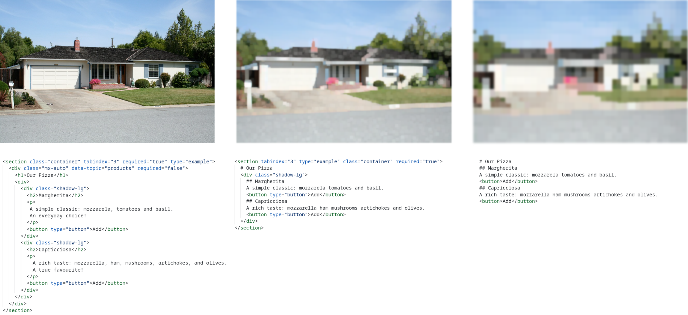

# D2Snap



**D2Snap** is a first-of-its-kind DOM downsampling algorithm, designed for use with LLM-based web agents.  

### Setup

``` console
npm install
```

> Provide LLM API provider key(s) to .env (compare [example](./.env.example)).

## 

### Build

``` console
npm run build
```

### Test

``` console
npm run test
```

### Evaluate

``` console
npm run eval:<snapshot>
```

> `<snapshot>` ∈ { `gui`, `dom`, `bu`, `D2Snap` }

``` console
npm run eval:D2Snap -- --verbose --split 10,20 --provider openai --model gpt-4o
```

### Re-create Snapshots

``` console
npm run snapshots:create
```